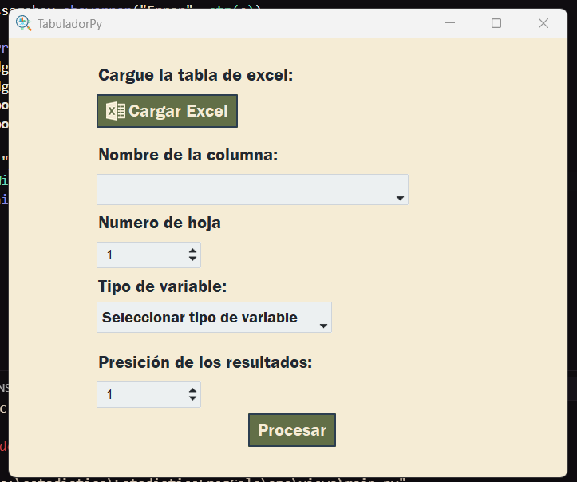
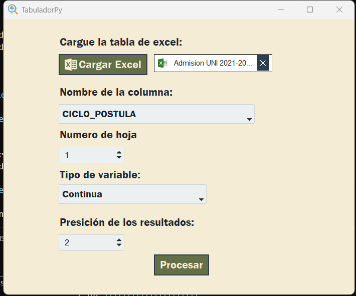
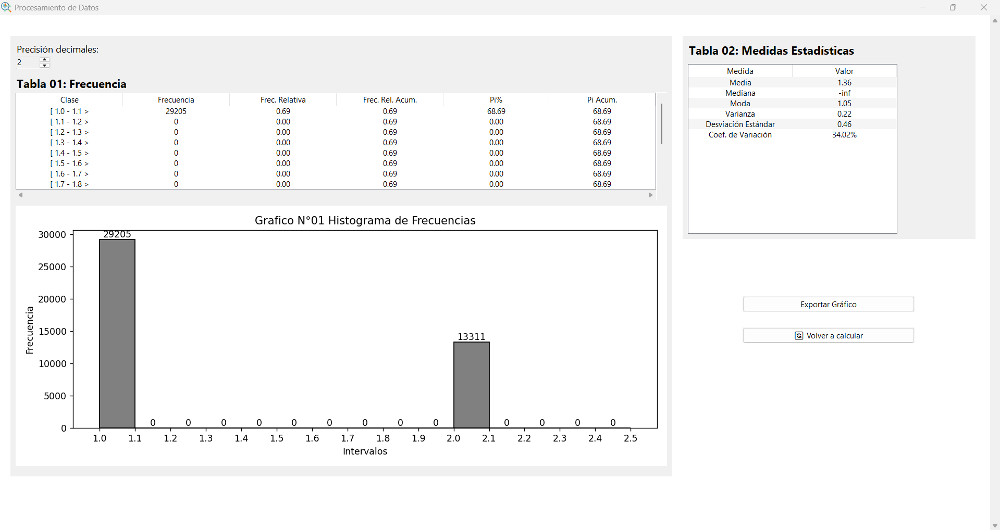

# 📊 Programa de Cálculo de Frecuencias

Programa desarrollado usando el lenguaje de programación Python, junto con las librerías NumPy, Pandas y Matplotlib.

Tiene como propósito servir de ayuda en el análisis de grandes volúmenes de datos.

---

## 📑 Tabla de Contenido

1. [Descripción](#descripción)
2. [Estructura del Proyecto](#estructura-del-proyecto)
3. [Demo](#demo)
4. [Instalación](#instalación)
5. [Guía de Uso](#guía-de-uso)
6. [Contribuidores](#contribuidores)

---

## 📚 Descripción

El programa fue desarrollado como proyecto para el curso de *Estadística 2025-I*.  
Tiene el propósito de calcular las tablas de frecuencias de un conjunto de datos junto con sus respectivas medidas de tendencia central (si es que los datos ingresados son cuantitativos).

---

## 📁 Estructura del Proyecto

```
EstadisticaFreqCalc/
├── assets/                 # Recursos gráficos y archivos auxiliares
├── src/                    # Código fuente principal del programa
│   └── main.py             # Script principal de ejecución
├── .gitignore              # Archivos y carpetas ignorados por Git
├── LICENSE                 # Licencia del proyecto (GPL-3.0)
└── README.md               # Documentación del proyecto
```

---

## 📸 Demo





---

## 🚀 Instalación

### Programas requeridos

1. Un editor de código como VSCode.
2. El sistema de control de versiones Git.
3. El lenguaje de programación Python 3.12.X.

### Librerías necesarias

Asegúrate de tener instaladas las siguientes librerías:

- NumPy 2.2.5
- Pandas 2.2.3
- Matplotlib 3.10.1

Puedes instalarlas utilizando el siguiente comando:

```bash
pip install numpy==2.2.5 pandas==2.2.3 matplotlib==3.10.1
```

---

## 📝 Guía de Uso

1. Clona el repositorio:

```bash
git clone https://github.com/JunixOs/EstadisticaFreqCalc.git
cd EstadisticaFreqCalc
```

2. Ejecuta el script principal:

```bash
python src/main.py
```

3. Sigue las instrucciones en pantalla para ingresar tus datos.

4. El programa generará:

   - Tabla de frecuencias.
   - Medidas de tendencia central (media, mediana y moda).
   - Gráficos representativos utilizando Matplotlib.

---

## 🤝 Contribuidores

Este proyecto fue desarrollado por el equipo de Estadística.

¡Las contribuciones son bienvenidas! Si deseas mejorar este proyecto, por favor sigue estos pasos:

1. Haz un fork del repositorio.
2. Crea una nueva rama: `git checkout -b feature/nueva-funcionalidad`.
3. Realiza tus cambios y haz commit: `git commit -m 'Agrega nueva funcionalidad'`.
4. Sube tus cambios: `git push origin feature/nueva-funcionalidad`.
5. Abre un Pull Request.

---

## 📄 Licencia

Este proyecto está licenciado bajo la Licencia Pública General GNU v3.0. Consulta el archivo [LICENSE](LICENSE) para más detalles.

